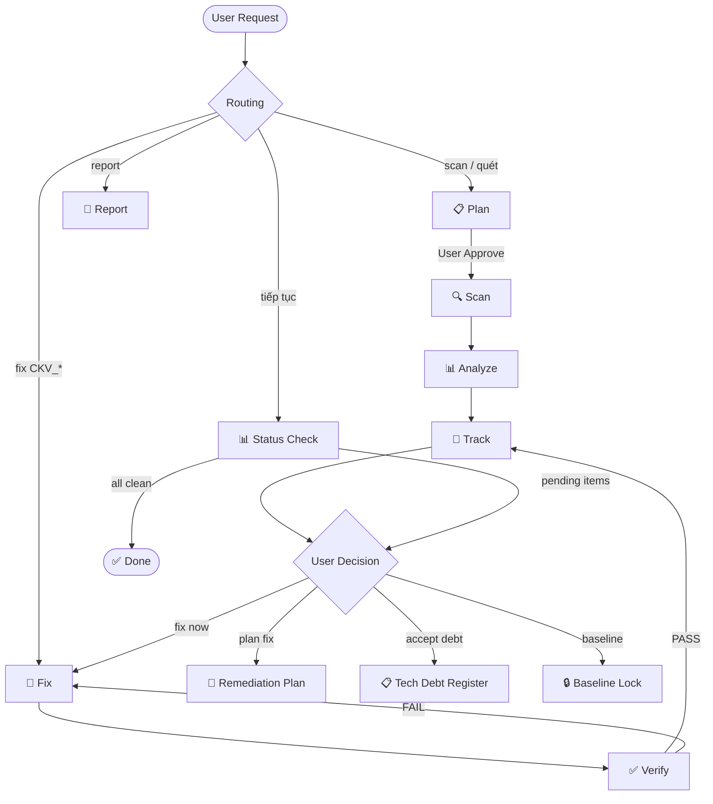
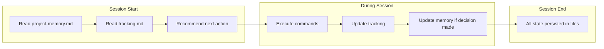
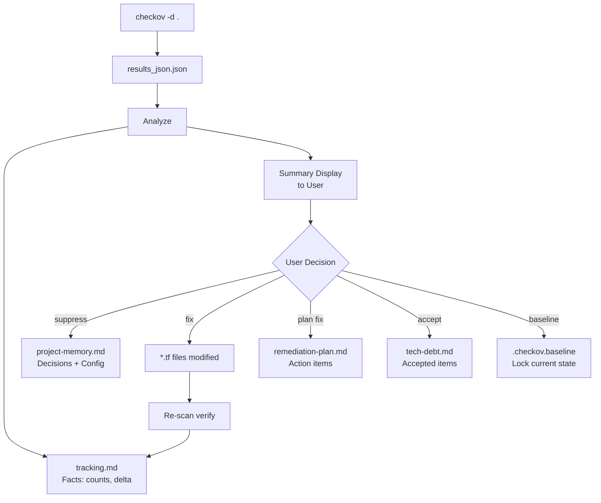

# IaC Checkov AWS — Kiro Power

Scan và bảo mật AWS Infrastructure as Code (Terraform, CloudFormation) bằng [Checkov](https://www.checkov.io/). Chạy trực tiếp trên máy local với plan, tracking, memory giữa sessions, và remediation tự động.

## Cài đặt

### 1. Cài Checkov

```bash
pip install checkov
# hoặc
brew install checkov
```

### 2. Cài Power vào Kiro

Mở Kiro → Powers panel → Install from repository:

```
https://github.com/TDFS-Dom/iac-checkov-aws-power
```

Hoặc clone về local:

```bash
git clone https://github.com/TDFS-Dom/iac-checkov-aws-power.git
```

Rồi cài từ local folder trong Kiro Powers panel.

## Sử dụng

### Scan toàn bộ Landing Zone

Power được thiết kế cho **multi-folder Landing Zone** (level0 → level4, modules, policies...). Mở chat trong Kiro và nói:

```
Scan toàn bộ Landing Zone
```

Power sẽ scan **recursive** toàn bộ workspace — bao gồm tất cả subdirectories:

```
your-landing-zone/
├── _modules/               ← scan
├── level0-foundation/      ← scan
├── level1-security/        ← scan
├── level2-connectivity/    ← scan
├── level3-account-vending/ ← scan
├── level4-operations/      ← scan
├── management/             ← scan
├── network/                ← scan
├── policies/               ← scan
├── svc-nonprd/             ← scan
├── svc-prod/               ← scan
├── user-management/        ← scan
└── ...                     ← scan hết
```

Command thực thi:
```bash
checkov -d . --framework terraform --compact -o json -o cli \
  --output-file-path .checkov-reports \
  --download-external-modules true
```

> `-d .` scan recursive từ root — KHÔNG cần chỉ từng folder.

### Scan từng level riêng (optional)

```
Scan chỉ level1-security
```

```bash
checkov -d ./level1-security --framework terraform --compact -o json
```

### Tiếp tục sau session trước

```
Tiếp tục — bước tiếp theo là gì?
```

### Fix finding cụ thể

```
Fix CKV_AWS_93 trong level0-foundation/s3.tf
```

### Xem compliance report

```
Report compliance CIS AWS
```

### Tạo baseline

```
Tạo baseline cho infrastructure hiện tại
```

## Workflow

### Execution Flow



### Session Continuity



### Data Flow — What Goes Where



### Lifecycle

```
[1] PLAN → [2] SCAN → [3] ANALYZE → [4] TRACK → [5] REMEDIATE → [6] VERIFY → [7] REPORT
```

| Phase | Mô tả |
|-------|--------|
| Plan | Detect files, check prerequisites, tạo plan → user approve |
| Scan | Chạy `checkov` full scan local (tất cả 456 AWS checks) |
| Analyze | Parse JSON → severity breakdown → top findings |
| Track | Append vào tracking.md (lịch sử, delta) |
| Remediate | Fix finding → sửa file .tf trực tiếp |
| Verify | Re-scan targeted check → confirm PASS |
| Report | Map findings sang CIS/PCI-DSS/HIPAA/SOC2 |

## Output

Sau khi scan, power tạo (tại root của project):

```
your-landing-zone/
├── .checkov-reports/
│   ├── state/                          # Persistent — đọc mỗi session
│   │   ├── tracking.md                # Scan timeline + remediation progress
│   │   └── project-memory.md          # Decisions, suppressions, config
│   ├── scans/                          # Versioned — mỗi scan 1 folder
│   │   ├── 001/
│   │   │   ├── metadata.md            # Scan info (date, scope, version)
│   │   │   ├── results.json           # Raw Checkov output
│   │   │   ├── summary.md            # Human-readable findings
│   │   │   └── plan.md               # Approved scan plan
│   │   ├── 002/
│   │   │   ├── metadata.md
│   │   │   ├── results.json
│   │   │   ├── summary.md
│   │   │   ├── plan.md
│   │   │   └── delta.md              # Changes vs scan #001
│   │   └── latest.txt                 # "002" — current scan number
│   └── reports/                        # On-demand documents
│       ├── remediation-plan.md
│       ├── tech-debt.md
│       └── compliance/
│           └── cis-aws.md
├── .checkov.yaml                       # Scan config
├── .checkov.baseline                   # Baseline lock (when created)
├── level0-foundation/
├── level1-security/
└── ...
```

### Kết quả grouped theo folder

Power phân loại findings theo structure:

```
📊 Scan Results — Landing Zone
━━━━━━━━━━━━━━━━━━━━━━━━━━━━━━

| Folder | Passed | Failed | CRITICAL | HIGH |
|--------|--------|--------|----------|------|
| level0-foundation | 23 | 2 | 0 | 1 |
| level1-security | 45 | 0 | 0 | 0 |
| level2-connectivity | 31 | 5 | 1 | 3 |
| network | 18 | 3 | 0 | 2 |
| _modules | 52 | 1 | 0 | 0 |
| ... | | | | |
```

## Coverage

- **456 unique AWS checks** (CKV_AWS_1 → CKV_AWS_392, CKV2_AWS_1 → CKV2_AWS_78)
- **Frameworks**: Terraform, CloudFormation, Serverless (SAM)
- **Compliance**: CIS AWS, PCI-DSS, HIPAA, SOC2, NIST 800-53, GDPR
- **Full list**: xem [`references/aws-checks-full-list.md`](references/aws-checks-full-list.md)

## Architecture

```
iac-checkov-aws-power/
├── POWER.md                     # Metadata + documentation (Kiro reads this)
├── README.md                    # Hướng dẫn sử dụng (bạn đang đọc)
├── references/
│   └── aws-checks-full-list.md  # 456 checks offline reference
└── steering/                    # Workflow guides (Kiro loads on-demand)
    ├── secops-contract.md       # Core rules, paths, behavior
    ├── secops-routing.md        # Intent → command dispatch
    ├── secops-token-budget.md   # Context window management
    ├── checkov-aws-scan.md      # Execution workflow
    └── checkov-aws-compliance.md # Compliance mapping tables
```

## Key Principles

- **Plan-First**: Không scan khi chưa có user approve
- **Full-Scan Default**: Quét tất cả 456 checks, phân loại sau
- **Append-Only Tracking**: History chỉ append, không overwrite
- **Session Continuity**: Nhớ context giữa sessions qua tracking + memory files
- **Auto-Verify**: Fix xong → tự re-scan check đó

## Yêu cầu

- [Kiro IDE](https://kiro.dev)
- Python ≥ 3.8
- Checkov (`pip install checkov`)
- Terraform hoặc CloudFormation files trong workspace

## Dành cho Landing Zone

Power hoạt động tốt nhất với AWS Landing Zone / Control Tower / AFT structure:

- **Multi-level**: level0 → level4, scan tất cả trong 1 command
- **Shared modules**: `_modules/`, `module-ref/` — scan kèm `--download-external-modules`
- **Policies as Code**: `policies/` folder — Checkov graph-based checks detect cross-resource issues
- **Multi-account**: `svc-prod/`, `svc-nonprd/`, `management/` — findings grouped per account layer
- **CI/CD integration**: `.gitlab-ci.yml` / `.github/` — power suggest `.checkov.yaml` config phù hợp

### Recommended .checkov.yaml cho Landing Zone

```yaml
framework:
  - terraform

skip-path:
  - .terraform/
  - .terragrunt-cache/
  - _backend/
  - _cicd/
  - docs/
  - scripts/
  - plans/

download-external-modules: true
compact: true

output:
  - cli
  - json

output-file-path: .checkov-reports
```

## License

MIT
