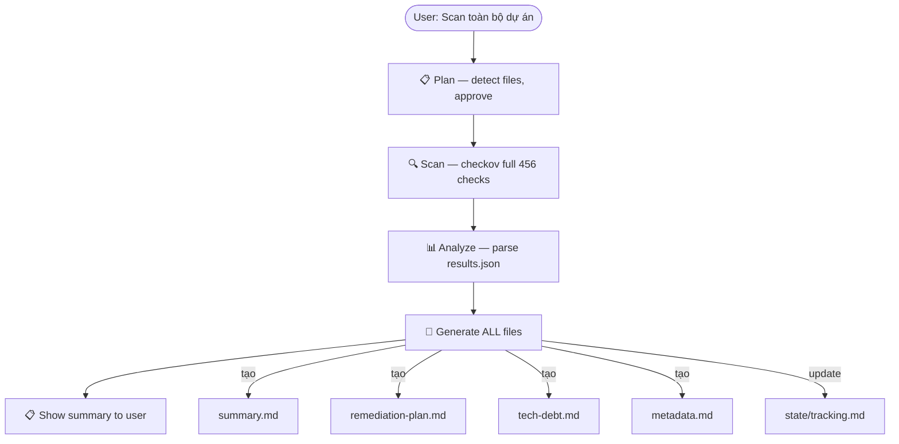
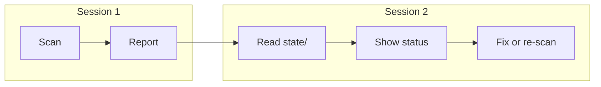

# IaC Checkov AWS — Kiro Power

Scan và bảo mật AWS Infrastructure as Code (Terraform, CloudFormation) bằng [Checkov](https://www.checkov.io/). Chạy trực tiếp trên máy local, tự động tạo report đầy đủ sau mỗi scan.

## Cài đặt

### 1. Cài Checkov

```bash
pip install checkov
# hoặc
brew install checkov
```

### 2. Cài Power vào Kiro

Mở Kiro → Powers panel → Install from repository:

```
https://github.com/TDFS-Dom/iac-checkov-aws-power
```

## Sử dụng

Mở chat trong Kiro, nói:

```
Scan toàn bộ dự án
```

Power tự động chạy full pipeline — không cần thêm lệnh nào:

```
Plan → Scan (456 AWS checks) → Analyze → Report đầy đủ
```

### Các lệnh khác

| Bạn nói | Power làm |
|---------|-----------|
| Scan toàn bộ dự án | Full pipeline + report |
| Fix CKV_AWS_93 | Sửa file .tf + verify |
| Tiếp tục | Xem state → recommend next |
| Report CIS AWS | Compliance report |
| Review skip | Đánh giá logic các `#checkov:skip` trong code |
| Review outdate | Tìm skip hết hạn, orphaned, deprecated |
| Suppress CKV_AWS_18 | Thêm inline skip với justification |
| Tạo baseline | Lock current state |
| Export docx | Xuất security report .docx |

## Output — Mỗi scan tạo gì?

Mỗi scan tạo 1 folder hoàn chỉnh (self-contained snapshot):

```
.checkov-reports/
├── state/
│   ├── tracking.md                # Timeline tất cả scans
│   └── project-memory.md          # Decisions, suppressions
├── scans/
│   ├── 001/
│   │   ├── plan.md                # Scan plan đã approve
│   │   ├── metadata.md            # Context (date, version, scope)
│   │   ├── results.json           # Raw Checkov output
│   │   ├── summary.md            # Findings overview
│   │   ├── remediation-plan.md   # Priority fix plan (P0→P3)
│   │   └── tech-debt.md          # Accepted debt register
│   ├── 002/
│   │   ├── ... (same)
│   │   └── delta.md              # Changes vs scan trước
│   └── latest.txt                 # "002"
└── reports/
    └── compliance/
        └── cis-aws.md
```

## Workflow





## remediation-plan.md — Chi tiết

Mỗi finding có đầy đủ:

| # | Check ID | Finding | Resource | File | Line | Owner | Status |
|---|----------|---------|----------|------|------|-------|--------|
| 1 | CKV_AWS_93 | S3 public access | `aws_s3_bucket.data` | `level0-foundation/s3.tf` | 15 | TBD | ⬚ Open |

Grouped theo priority:
- **P0 (CRITICAL)** — fix trong 24h
- **P1 (HIGH)** — fix sprint này
- **P2 (MEDIUM)** — plan quarter tới
- **P3 (LOW)** — backlog hoặc suppress

## Coverage

- **456 unique AWS checks** (full scan, không filter) — mỗi check có severity (CRITICAL/HIGH/MEDIUM/LOW)
- **Frameworks**: Terraform, CloudFormation, SAM
- **Compliance**: CIS AWS, PCI-DSS, HIPAA, SOC2, NIST, GDPR
- **Severity lookup**: [`references/aws-checks-full-list.md`](references/aws-checks-full-list.md) (456 checks + severity column)
- **Classification logic**: [`references/severity-classification.md`](references/severity-classification.md) (scoring matrix for new checks)

## Dành cho Landing Zone

Scan recursive toàn bộ workspace — cover hết multi-folder structure:

```
your-landing-zone/
├── level0-foundation/      ← scan
├── level1-security/        ← scan
├── level2-connectivity/    ← scan
├── _modules/               ← scan
├── policies/               ← scan
├── svc-prod/               ← scan
└── ...                     ← scan hết
```

Command: `checkov -d . --framework terraform --download-external-modules true`

### Recommended .checkov.yaml

```yaml
framework:
  - terraform

skip-path:
  - .terraform/
  - _backend/
  - docs/
  - scripts/

download-external-modules: true
compact: true
output:
  - json

# NOTE: output-file-path NOT set here — agent controls via --output-file-path flag
# to ensure output goes to correct scans/{NNN}/ folder per scan
```

## Architecture

```
iac-checkov-aws-power/
├── POWER.md                             # Kiro entry point
├── README.md                            # Bạn đang đọc
├── references/
│   ├── aws-checks-full-list.md          # 456 checks + severity column
│   ├── severity-classification.md       # Scoring matrix + fallback rules
│   └── templates/                       # Templates cho mọi output
│       ├── parse-results-guide.md       # JSON→template mapping
│       ├── directory-structure.md       # Folder rules
│       ├── plan.md
│       ├── metadata.md
│       ├── summary.md
│       ├── delta.md
│       ├── remediation-plan.md
│       ├── tech-debt.md
│       ├── tracking.md
│       └── project-memory.md
└── steering/                            # Kiro loads on-demand (7 files)
    ├── secops-contract.md               # Core rules (always-loaded)
    ├── secops-routing.md                # Intent dispatch (always-loaded)
    ├── secops-token-budget.md           # Context management
    ├── checkov-aws-scan.md              # Execution workflow
    ├── checkov-aws-compliance.md        # Compliance mapping
    ├── checkov-aws-skip-review.md       # Review skip logic + detect outdated
    └── docx-export.md                   # Export to .docx
```

## Key Principles

- **Full Scan Default** — 456 checks, không filter, không skip
- **Full Pipeline** — "scan dự án" = chạy hết + report tự động
- **Per-Scan Snapshot** — mỗi scan folder là self-contained
- **Session Continuity** — nhớ state giữa sessions
- **Parse Real Data** — extract từ results.json, không để placeholder

## Yêu cầu

- [Kiro IDE](https://kiro.dev)
- Python ≥ 3.8
- Checkov (`pip install checkov`)

## License

MIT
